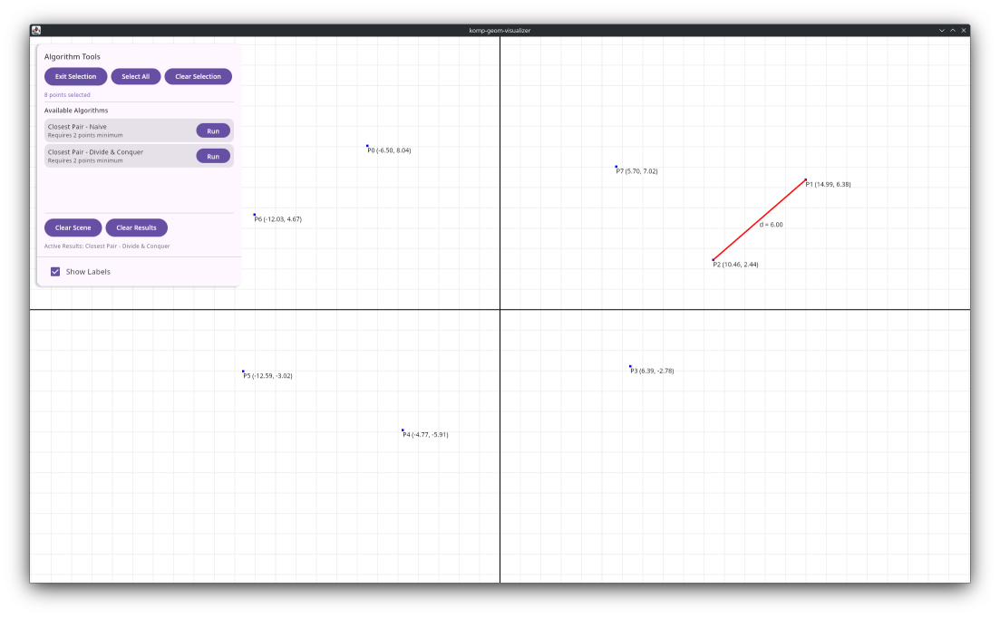

# Komp Geom Visualizer

Visualization tool for the [Komp Geom](https://github.com/cponfick/komp-geom) Kotlin multiplatform library. Displays computational geometry algorithms and data structures for debugging and educational purposes.



## Usage

**Desktop:**
```bash
./gradlew jvmRun -DmainClass=io.github.cponfick.MainKt --quiet
```

**Web:**
```bash
./gradlew :composeApp:wasmJsBrowserDevelopmentRun
```
