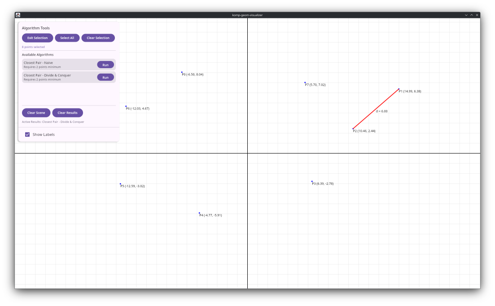

# Komp Geom Visualizer

Visualization tool for the [Komp Geom](https://github.com/cponfick/komp-geom) Kotlin multiplatform library. It displays computational geometry algorithms for debugging and education.



## Usage

- **Add points:** leave Selection Mode off and click the canvas.
- **Select points:** enable Selection Mode, then click points (selection uses a fixed 12-pixel hit radius). Use **Select All** when needed.
- **Pan:** drag the canvas. **Zoom:** use the mouse/trackpad wheel; zoom is centered on the pointer.
- **Clear Results** removes overlays. Editing the scene or selection also removes overlays because results describe the exact current input.
- **Clear Scene** removes all points and selection. Point IDs remain monotonic during the session, so labels are never silently reused.

Algorithms run on explicitly selected scene objects. Add points for point algorithms, or choose Draw segments and drag to create non-zero-length segments for Bentley–Ottmann. Select segments directly; the algorithm reports all intersecting segment pairs, including point contacts and collinear overlaps. To add an adapter, register an `AlgorithmDescriptor` in `AlgorithmRegistry` and provide its geometry-aware implementation.

## Build and test

Use JDK 17 or newer. The Gradle wrapper uses Gradle 9.1.0, which supports JDK 25.

```bash
./gradlew :composeApp:jvmTest
./gradlew :composeApp:compileKotlinJvm :composeApp:compileKotlinWasmJs
```

**Desktop:**
```bash
./gradlew jvmRun -DmainClass=io.github.cponfick.MainKt --quiet
```

**Web:**
```bash
./gradlew :composeApp:wasmJsBrowserDevelopmentRun
```

The browser target requires a current browser with WebAssembly support and Node/Yarn tooling supplied by the Gradle Kotlin/Wasm plugin. Browser interaction smoke checklist: resize while panned/zoomed (viewport should retain navigation), click immediately after dragging/zooming, select points at different zoom levels, and run/clear each algorithm.
